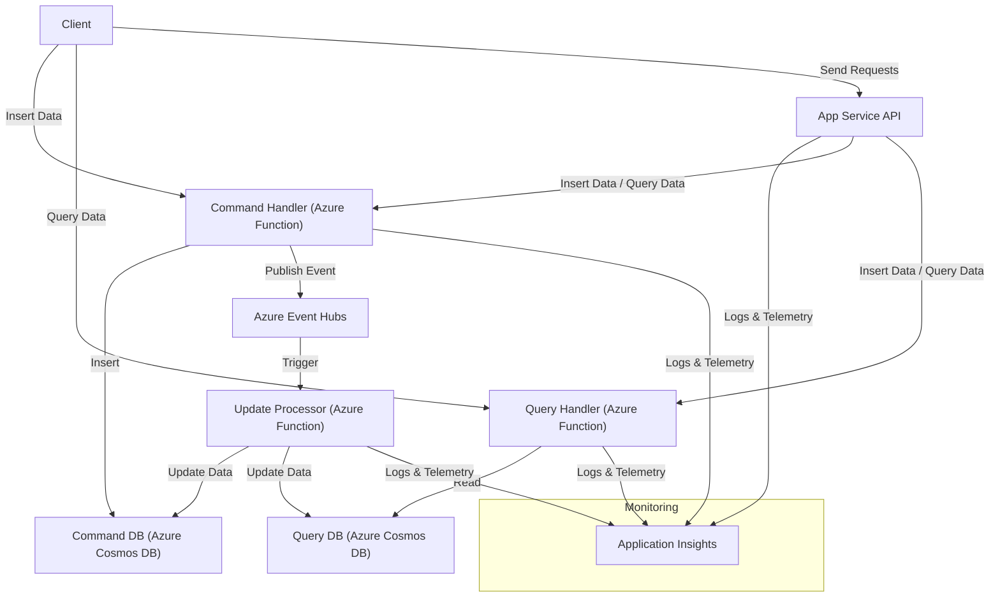

# CQRS Pattern on Azure

This repository implements the **CQRS (Command Query Responsibility Segregation) Pattern** using Azure services, including Azure Functions, Azure Cosmos DB, and Azure Event Hubs. The CQRS Pattern separates read and write operations for a data store, optimizing them independently for performance and scalability.

## 🏗️ Architectural Overview

The **CQRS Pattern** architecture consists of the following components:

1. **App Service API**: Acts as the main entry point for both command and query operations.
2. **Command Handler Function**: Handles data insertion (command) operations and publishes events to **Azure Event Hubs**.
3. **Update Processor Function**: Listens to events from **Azure Event Hubs** and updates the **Command DB**.
4. **Query Handler Function**: Handles data retrieval (query) operations by accessing the **Query DB**.
5. **Azure Event Hubs**: Serves as the event streaming platform for processing events.
6. **Azure Cosmos DB**: Used for both command (write) and query (read) operations.


### 📊 Architectural Diagram



## 📂 Repository Structure

```
/cqrs-pattern
│
├── README.md                                # Root README with architecture overview and getting started
├── LICENSE                                  # MIT License
│
├── infrastructure
│   ├── README.md                            # README for Infrastructure deployment
│   ├── azure-resources.bicep                # Bicep template for all Azure resources
│   └── .github/workflows/deploy-bicep.yml   # GitHub Action to deploy Azure resources
│
├── app-service-api
│   ├── README.md                            # README for App Service API
│   ├── Program.cs                           # C# code for App Service API
│   ├── appsettings.json                     # App settings for API configuration
│   └── .github/workflows/deploy-api.yml     # GitHub Action to deploy App Service API
│
├── command-handler
│   ├── README.md                            # README for Command Handler Function
│   ├── CommandHandler.cs                    # C# code for Command Handler Function
│   └── .github/workflows/deploy-command-handler.yml # GitHub Action to deploy Command Handler Function
│
├── update-processor
│   ├── README.md                            # README for Update Processor Function
│   ├── UpdateProcessor.cs                   # C# code for Update Processor Function
│   └── .github/workflows/deploy-update-processor.yml # GitHub Action to deploy Update Processor Function
│
├── query-handler
│   ├── README.md                            # README for Query Handler Function
│   ├── QueryHandler.cs                      # C# code for Query Handler Function
│   └── .github/workflows/deploy-query-handler.yml # GitHub Action to deploy Query Handler Function
```

## 🚀 Getting Started

### Step 1: Deploy the Infrastructure

1. Navigate to the **`infrastructure`** folder.
2. Follow the instructions in the [Infrastructure README](infrastructure/README.md) to deploy the required Azure resources using the Bicep template and GitHub Actions.

### Step 2: Deploy the Azure Functions and App Service API

1. Deploy the **Command Handler Function**:
   - Navigate to the **`command-handler`** folder.
   - Follow the instructions in the [Command Handler Function README](command-handler/README.md) to deploy the function using GitHub Actions.

2. Deploy the **Update Processor Function**:
   - Navigate to the **`update-processor`** folder.
   - Follow the instructions in the [Update Processor Function README](update-processor/README.md) to deploy the function using GitHub Actions.

3. Deploy the **Query Handler Function**:
   - Navigate to the **`query-handler`** folder.
   - Follow the instructions in the [Query Handler Function README](query-handler/README.md) to deploy the function using GitHub Actions.

4. Deploy the **App Service API**:
   - Navigate to the **`app-service-api`** folder.
   - Follow the instructions in the [App Service API README](app-service-api/README.md) to deploy the API using GitHub Actions.

5. 📊 Monitoring and Logging with Application Insights

This repository uses **Azure Application Insights** to monitor and collect telemetry data from all the Azure Functions and the App Service API. Application Insights helps to:

- Track request rates, response times, and failure rates.
- Monitor the performance of each service.
- Diagnose failures and exceptions.
- Gain insights into the usage patterns and overall health of the system.

### How to View Application Insights Data

1. Go to the **Azure Portal**.
2. Navigate to **Application Insights** and select the **`cqrsAppInsights`** resource.
3. Use the available tools to explore logs, requests, failures, dependencies, and custom metrics.

By using Application Insights, you can maintain visibility into the operational status and performance of your CQRS architecture on Azure.

## 💡 How It Works

1. **Insert Data**:
   - The **Command Handler Function** handles data insert operations and publishes events to **Azure Event Hubs**.
   - The **Update Processor Function** listens to these events and updates the **Command DB**.

2. **Query Data**:
   - The **Query Handler Function** handles data retrieval (query) operations from the **Query DB**.

## 📄 License

This project is licensed under the MIT License - see the [LICENSE](LICENSE) file for details.

## 🙌 Contributing

Contributions are welcome! Please open an issue or submit a pull request for any improvements or suggestions.
